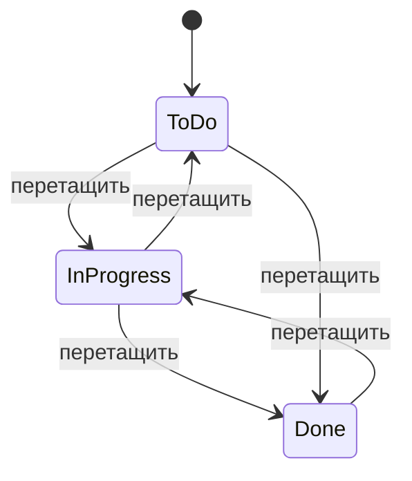

# Мини-канбан-доска — спецификация MVP

*По состоянию на 2026-09-21*

Это базовая спецификация для ИИ-агента, который будет разрабатывать mini-канбан-доску: веб-приложение для одного пользователя, где можно создавать задачи и перетаскивать их между колонками ("To Do" → "In Progress" → "Done"). Бэкенд — FastAPI (Python) с базой данных, без авторизации; фронтенд предложен как лёгкий вариант на vanilla HTML/CSS/JS — при желании можно заменить на React.

## Цель и объём MVP

Цель — минимальная канбан-доска для одного пользователя: список задач, три фиксированные колонки и перетаскивание задач между ними мышью.

**Входит в MVP:**
- Одна доска с тремя колонками: «To Do», «In Progress», «Done»
- Создание, редактирование и удаление задачи (заголовок + описание)
- Перетаскивание задачи между колонками (drag-and-drop)
- Изменение порядка задач внутри колонки
- Данные сохраняются на сервере и переживают перезагрузку страницы

**Не входит в MVP (следующие итерации):**
- Авторизация и несколько пользователей
- Несколько досок
- Настраиваемые колонки (добавление/удаление/переименование)
- Сроки, метки, вложения, комментарии к задачам
- Уведомления, поиск, фильтры

## Технологический стек

**Бэкенд:** Python 3.11+, FastAPI, Uvicorn. Хранение — SQLAlchemy + SQLite (файл базы, отдельный сервер БД не нужен): проще всего для одного пользователя, при росте легко перейти на PostgreSQL через тот же ORM.

**Фронтенд (предложение, требует подтверждения):** vanilla HTML/CSS/JS без сборки, библиотека SortableJS для drag-and-drop, запросы к backend через fetch. Выбран потому, что это быстрее всего собрать ИИ-агенту и запустить без сборки; при желании можно заменить на React + dnd-kit.

**Коммуникация:** фронтенд обращается к backend по REST API (JSON), FastAPI отдаёт статику или работает как отдельный API-сервер за CORS.

## Модель данных

Доска одна и неявная (без отдельной таблицы Board), состоит из колонок и задач.

**Column**

| Поле | Тип | Описание |
| --- | --- | --- |
| id | int | Первичный ключ |
| name | string | Название колонки (в MVP — одно из "To Do", "In Progress", "Done") |
| order | int | Позиция колонки на доске |

**Task**

| Поле | Тип | Описание |
| --- | --- | --- |
| id | int | Первичный ключ |
| title | string | Обязательно, до 200 символов |
| description | text | Необязательно |
| column_id | int (FK) | Ссылка на Column |
| position | int | Порядок внутри колонки |
| created_at | datetime | Ставится автоматически |
| updated_at | datetime | Обновляется при любом изменении |

Колонки создаются один раз при инициализации БД (seed-скрипт) и не редактируются через UI в MVP.

## API

Все эндпоинты под префиксом `/api`, обмен JSON.

| Метод | Путь | Описание |
| --- | --- | --- |
| GET | /api/board | Все колонки со вложенными задачами — полное состояние доски для первоначальной загрузки |
| POST | /api/tasks | Создать задачу: `{title, description?, column_id}` |
| GET | /api/tasks/{id} | Получить одну задачу |
| PATCH | /api/tasks/{id} | Обновить задачу: title, description, column_id, position — этим же эндпоинтом оформляется перетаскивание между колонками |
| DELETE | /api/tasks/{id} | Удалить задачу |
| GET | /api/columns | Список колонок (без задач, служебный) |

Ошибки: 404 — задача/колонка не найдена, 422 — валидация (пустой title и т.п.), стандартный формат ошибок FastAPI.

## Пользовательские сценарии

1. Открыть приложение — видны три колонки с текущими задачами.
2. Нажать «+» в колонке, ввести заголовок (и описание) — задача появляется в конце колонки.
3. Перетащить карточку в другую колонку — статус сразу сохраняется на сервере.
4. Перетащить карточку внутри колонки — меняется порядок.
5. Кликнуть по карточке — открывается форма/модалка с редактированием заголовка/описания.
6. Нажать иконку удаления на карточке (с подтверждением) — задача удаляется.
7. Обновить страницу — все задачи и их положение восстанавливаются из БД.

## Экран и переходы между колонками

Один экран: три колонки в ряд, в каждой — стопка карточек и кнопка добавления задачи. Перетаскивание разрешено в любом направлении между колонками:

Каждый переход — это PATCH /api/tasks/{id} с новым column_id.

## Критерии готовности

- [ ] Можно создать задачу с заголовком и (опционально) описанием
- [ ] Задача отображается в правильной колонке
- [ ] Задачу можно перетащить в другую колонку, и это сохраняется в БД
- [ ] Порядок задач внутри колонки можно менять, и он сохраняется
- [ ] Задачу можно отредактировать и удалить
- [ ] После перезагрузки страницы все задачи и их состояние восстанавливаются
- [ ] API покрыт базовой валидацией и обработкой ошибок (404, 422)
- [ ] Есть README с инструкцией по запуску backend и frontend

## Открытые вопросы

- Фронтенд: vanilla JS + SortableJS (проще и быстрее) или React (гибкость на будущее, но дольше настраивать)?
- Нужен ли Docker для запуска в одну команду?
- Планируется ли позже многопользовательский режим — если да, имеет смысл сразу заложить поле owner_id в модели
- Нужна ли валидация длины заголовка/описания на фронте?
